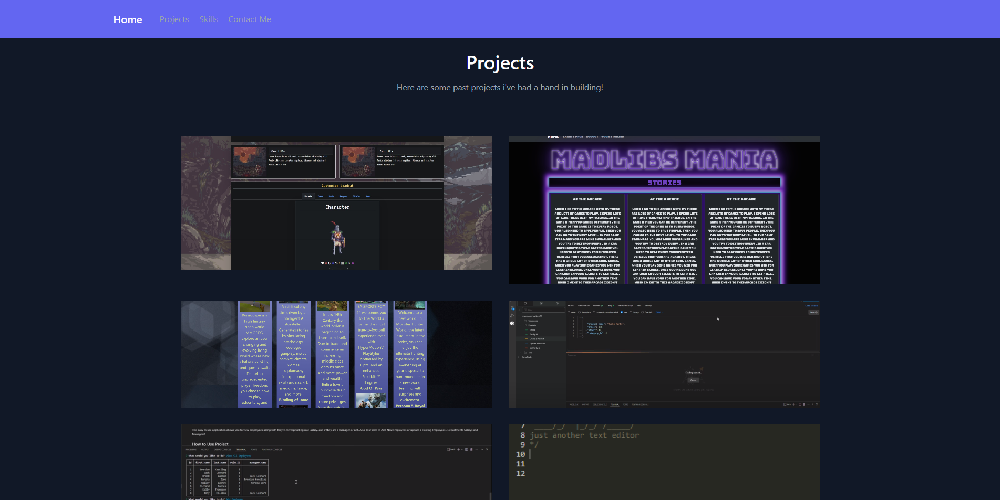

# React Resume

[Live-Site Here](https://brendankeesling.netlify.app/)

## Table of Context

- [Credits](#credits)
- [Description](#description)
- [Technology used](#technology-used)
- [Contact](#contact)
- [Contribute](#contribute)

## Credits.

 - [React Icons](https://react-icons.github.io/react-icons/)
 - [tailwindcss](https://tailwind.build/classes)
 - [freecodecamp](https://www.freecodecamp.org/news/build-portfolio-website-react/)

## Description.

#### Simple Resume made with React / vite / tailwindcss , Photo examples bellow.

## Technology Used.
 - React + Vite.
 - Tailwindcss.
 - Netlify.

## Contribute.

Project GitHub Here:

## Contact.

